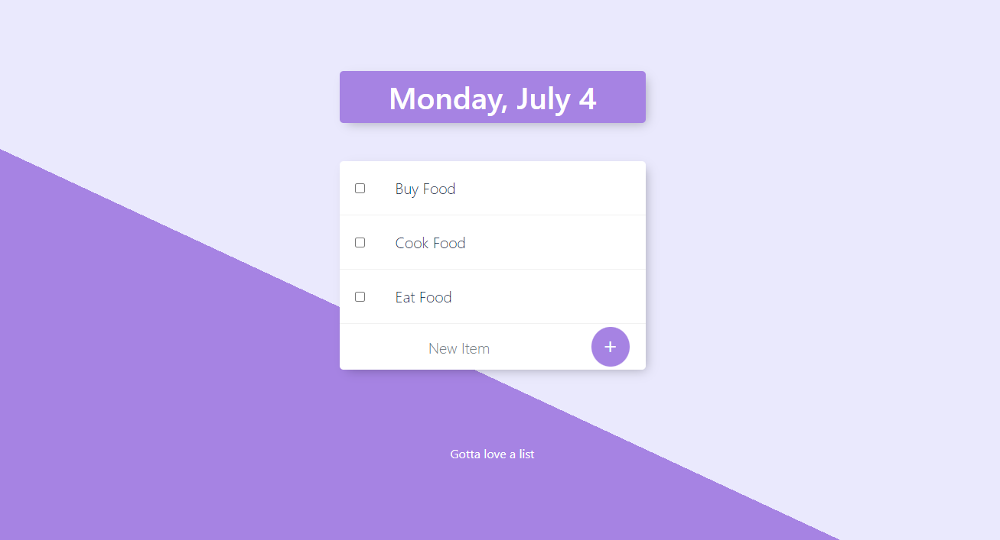

# To Do List using EJS

## Description
A simple To Do List using EJS (Embedded JavaScript) Templates

## Technologies
* [Express](https://expressjs.com)
* [EJS](https://ejs.co/#promo)
* [Body Parser](https://www.npmjs.com/package/body-parser)
* [Bootstrap](https://getbootstrap.com/)

## Credit
The Complete Web Development Bootcamp by Angela Yu (Section 22: EJS)

## Screenshot
